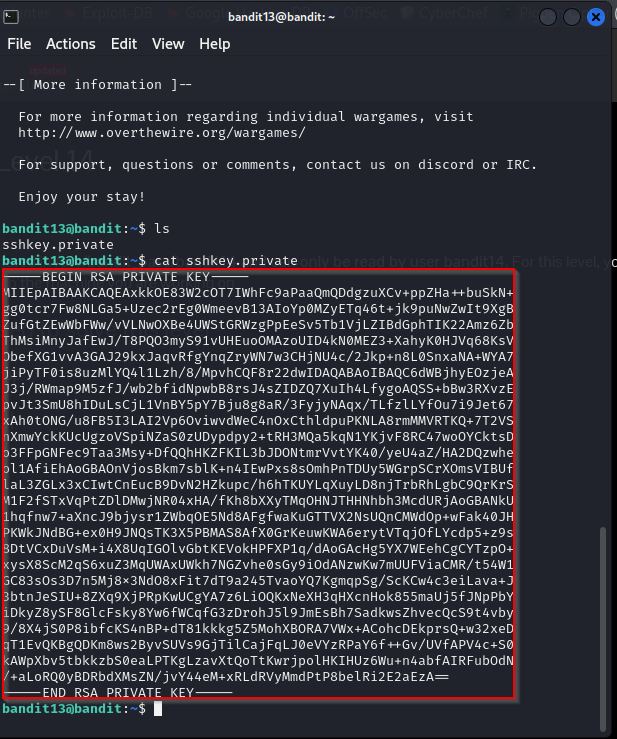
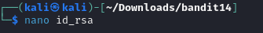

Bandit Level 13 → Level 14
Level Goal

The password for the next level is stored in /etc/bandit_pass/bandit14 and can only be read by user bandit14. For this level, you don’t get the next password, but you get a private SSH key that can be used to log into the next level. Note: localhost is a hostname that refers to the machine you are working on

To use this password for bandit14

TO DO: <code>bandit13@bandit:~$</code> ssh bandit14@bandit.labs.overthewire.org -p 2220 -i sshkey.private

`bandit14@bandit:~$` cat /etc/bandit_pass/bandit14
fGrHPx402xGC7U7rXKDaxiWFTOiF0ENq
