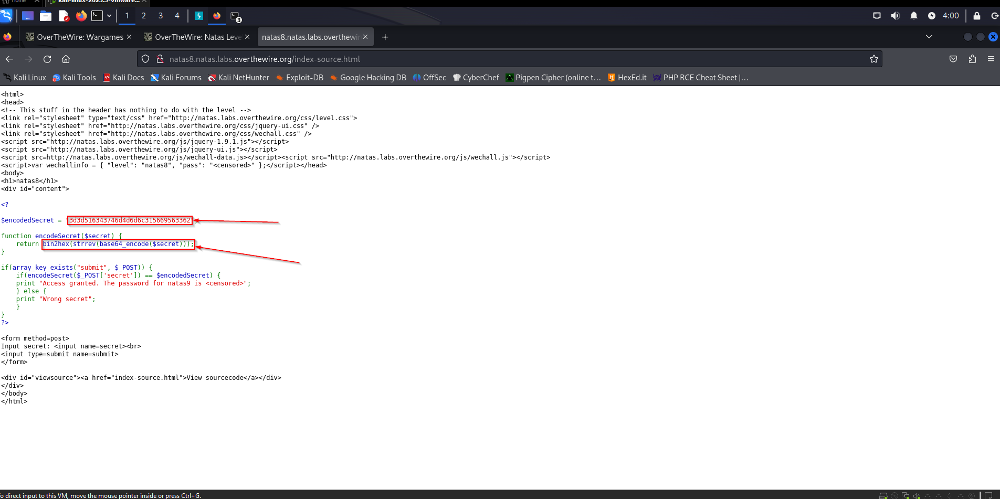
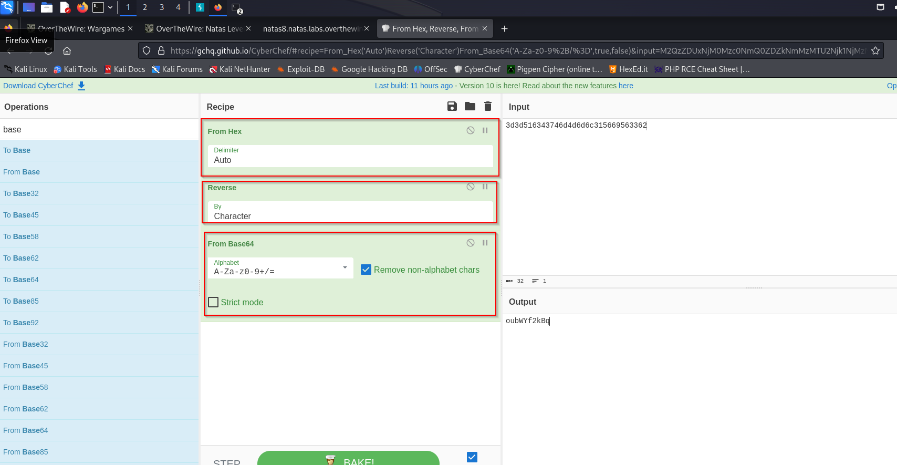
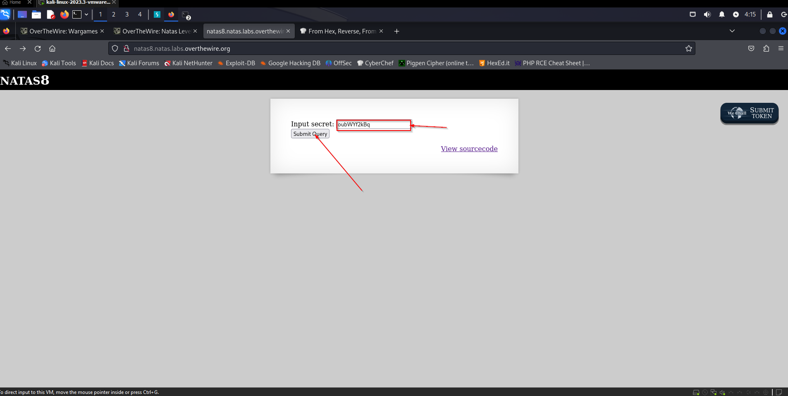
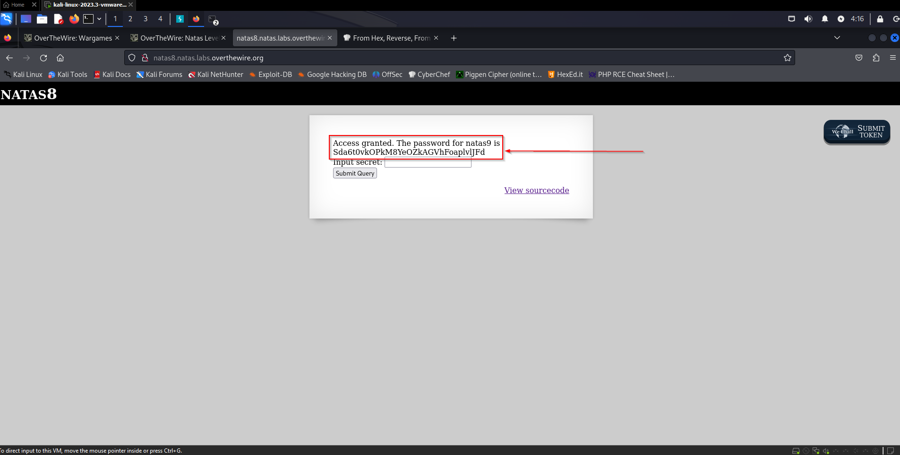

Natas Level 7 → Level 8

Username: natas8
URL:      http://natas8.natas.labs.overthewire.org

Click "View sourcecode"

This one has encoded 3d3d516343746d4d6d6c315669563362</code> 
We need to decode it!!!

Using Cyberchef (https://gchq.github.io/CyberChef/)

From the function encodeSecret process: 
Encode: <b>base64</b> -> <b>string reverse</b> -> <b>hex</b> 

So, the decode should be: 
Decode: <b>hex</b> -> <b>string reverse</b> -> <b>base64</b>

In Cyberchef, this should look like this:

oubWYf2kBq

Go back & submit

Finished!!!

Access granted. The password for natas9 is Sda6t0vkOPkM8YeOZkAGVhFoaplvlJFd