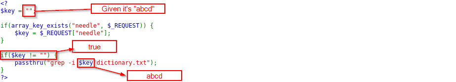

Natas Level 8 → Level 9

Username: natas9
URL:      http://natas9.natas.labs.overthewire.org

Click "View sourcecode" & see the code below.

The <code>$key</code> is the variable for text to input and use it with grep command.

For example, if the <code>$key = "abcd";</code>

The if-else statement will look like this:
  

In the Linux command, if you enter the <code>;</code> this will stop the command. For example:

Let's find the answer with the Linux command.

Another Information is  

All passwords are also stored in /etc/natas_webpass/.

<code>
; ls /etc/natas_webpass/
</code>

/etc/natas_webpass/: 
natas0
natas1
natas10
natas11
natas12
natas13
natas14
natas15
natas16
natas17
natas18
natas19
natas2
natas20
natas21
natas22
natas23
natas24
natas25
natas26
natas27
natas28
natas29
natas3
natas30
natas31
natas32
natas33
natas34
natas4
natas5
natas6
natas7
natas8
natas9

<code>
; file /etc/natas_webpass/natas10
</code>

/etc/natas_webpass/natas10: ASCII text 
dictionary.txt:            Unicode text, UTF-8 text

<code>
; cat /etc/natas_webpass/natas10
</code> 
D44EcsFkLxPIkAAKLosx8z3hxX1Z4MCE

